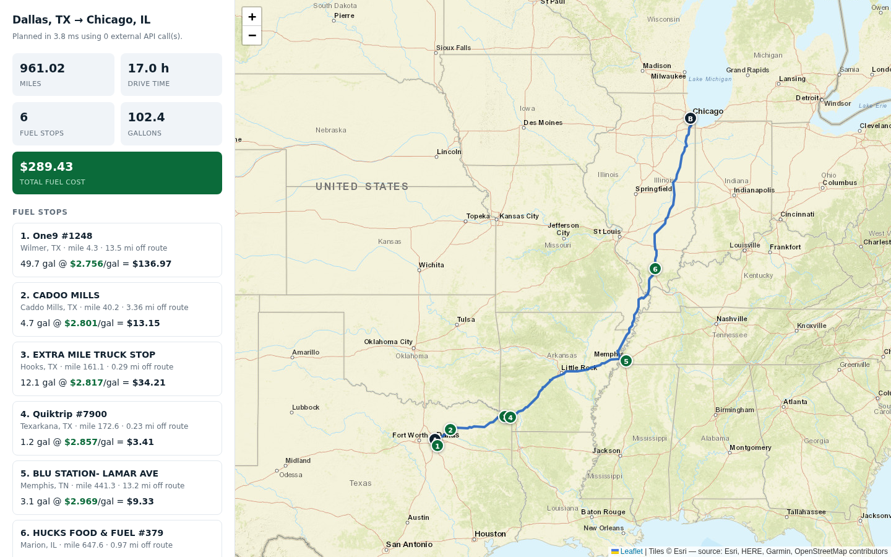

# Fuel Route API

An API that plans a drive between two US locations, picks the cheapest places to
buy fuel along the way, and returns the total fuel bill.

Built with Django 6.1 and Django REST Framework.



---

## What it does

Give it a start and a finish. It returns:

* the driving route, as an encoded polyline and as GeoJSON;
* the cheapest set of fuel stops for a vehicle with a 500 mile range;
* the gallons bought at each stop and the price paid;
* the total money spent on fuel at 10 miles per gallon.

A browser-friendly map of the same plan is served at `/api/v1/map/`.

---

## Quick start

Python 3.12 or newer is required, because Django 6.1 requires it.

```bash
# 1. Install. uv reads pyproject.toml and builds the virtualenv.
uv sync

# 2. Create the database.
uv run python manage.py migrate

# 3. Load the fuel prices.
uv run python manage.py import_fuel_prices data/fuel-prices-for-be-assessment.csv

# 4. Give every station a latitude and a longitude. No network calls.
uv run python manage.py geocode_stations

# 5. Run it.
uv run python manage.py runserver
```

Then:

```bash
curl -X POST http://127.0.0.1:8000/api/v1/route/ \
  -H 'Content-Type: application/json' \
  -d '{"start": "Dallas, TX", "finish": "Chicago, IL"}'
```

Open <http://127.0.0.1:8000/api/v1/map/?start=Dallas,+TX&finish=Chicago,+IL>
for the map.

### Without uv

```bash
python3.13 -m venv .venv
source .venv/bin/activate
pip install -r requirements.txt -r requirements-dev.txt
python manage.py migrate
python manage.py import_fuel_prices data/fuel-prices-for-be-assessment.csv
python manage.py geocode_stations
python manage.py runserver
```

Drop the `uv run` prefix from every command below if you install this way.

### The price file

`data/fuel-prices-for-be-assessment.csv` is the file supplied with the
assessment: 8151 rows, which collapse to 6967 distinct sites once the duplicate
rack listings are merged to the cheapest price per site.

`data/sample-fuel-prices.csv` is a synthetic stand-in with the same columns,
kept so the project still runs if the real file is removed.

The importer matches the header row by keyword rather than by exact spelling,
so a renamed or reordered column still loads. It prints the mapping it chose
before it writes anything.

The file has no coordinates, and its address column is a highway descriptor --
`I-44, EXIT 283 & US-69` -- not a street address. `geocode_stations` therefore
places each site by city and state against the bundled Census gazetteer, which
resolves **96.7 percent of the US sites with no network call**. The stragglers
are unincorporated crossroads; add `--use-nominatim` to send only those to the
public geocoder as a one-time job.

---

## Endpoints

| Method     | Path             | Purpose                                  |
|------------|------------------|------------------------------------------|
| POST / GET | `/api/v1/route/` | Plan a route and price its fuel stops.   |
| GET        | `/api/v1/map/`   | The same plan drawn on a Leaflet map.    |
| GET        | `/api/v1/health/`| Readiness, and how much data is loaded.  |
| GET        | `/api/v1/catalog/`| Price range and states in the catalogue.|

### Request

```json
{
  "start": "Dallas, TX",
  "finish": "Chicago, IL",
  "start_fuel_gallons": 0,
  "max_detour_miles": 15,
  "min_stop_spacing_miles": 10
}
```

`start` and `finish` accept four forms. The first three cost no external call:

| Form              | Example              | Resolved by            |
|-------------------|----------------------|------------------------|
| City and state    | `Dallas, TX`         | Offline gazetteer      |
| ZIP code          | `75201`              | Offline gazetteer      |
| Coordinates       | `32.7767,-96.7970`   | Used directly          |
| Any other text    | `The Alamo`          | Nominatim, then cached |

The last three fields are optional. Their defaults come from `.env`.

### Response

```jsonc
{
  "start":  { "query": "Dallas, TX", "latitude": 32.793333, "resolved_by": "gazetteer" },
  "finish": { "query": "Chicago, IL", "latitude": 41.837045, "resolved_by": "gazetteer" },
  "route": {
    "distance_miles": 961.02,
    "duration_hours": 17.04,
    "geometry_polyline6": "...",
    "bounds": [32.788344, -96.767691, 41.838447, -87.660792]
  },
  "vehicle": {
    "max_range_miles": 500.0,
    "miles_per_gallon": 10.0,
    "tank_capacity_gallons": 50.0,
    "start_fuel_gallons": 0.0,
    "usable_range_miles": 470.0      // the range legs are planned against,
  },                                 // once the worst-case detour is reserved
  "fuel_plan": {
    "stops": [
      {
        "opis_id": "63669",
        "name": "One9 #1248",
        "address": "I-45, EXIT 271",
        "city": "Wilmer", "state": "TX",
        "latitude": 32.599015, "longitude": -96.681585,
        "price_per_gallon": 2.756,
        "route_mile_marker": 4.3,
        "detour_miles": 13.5,
        "gallons_purchased": 49.7,   // route fuel plus the drive to the pump
        "gallons_for_route": 47.0,
        "gallons_for_detour": 2.7,
        "cost_usd": 136.97,
        "tank_gallons_on_arrival": 0.0,
        "tank_gallons_on_departure": 47.0,
        "is_origin_fill": true,
        "note": "Departure fill-up. The vehicle starts with an empty tank, so
                 this stop is priced as mile zero and covers the whole journey."
      }
      // ... five more
    ],
    "stop_count": 6,
    "total_gallons_purchased": 102.411,
    "total_cost_usd": 289.43,
    "average_price_per_gallon": 2.826,
    "fuel_consumed_gallons": 102.41,
    "route_fuel":  { "gallons": 96.102, "cost_usd": 271.42 },
    "detour_fuel": { "miles_driven": 63.09, "gallons": 6.309, "cost_usd": 18.01 }
  },
  "meta": {
    "external_api_calls": { "routing": 1, "geocoding": 0, "total": 1 },
    "stations_in_catalog": 6844,
    "stations_near_route": 244,
    "stations_considered": 47,
    "timing_ms": { "routing_provider": 902.6, "local_computation": 4.1, "total": 906.7 }
  }
}
```

Every response carries `meta.external_api_calls`, so the call count is not a
claim in a README. You can read it off each request.

### Errors

Every failure returns the same envelope and a status code that says whose
problem it is.

```json
{ "error": { "code": "infeasible_route", "message": "...", "details": {} } }
```

| Code                | Status | Meaning                                       |
|---------------------|--------|-----------------------------------------------|
| `invalid_request`   | 400    | The body failed validation.                   |
| `geocoding_failed`  | 422    | A location string did not resolve.            |
| `outside_coverage`  | 422    | A point sits outside the United States.       |
| `no_route`          | 422    | No road connects the two points.              |
| `infeasible_route`  | 422    | A gap between stations exceeds 500 miles.     |
| `routing_failed`    | 502    | The routing provider failed.                  |
| `catalog_empty`     | 503    | No stations are loaded.                       |

---

## How the requirements are met

### "One call to the map/route API is ideal"

**An ordinary request makes exactly one.**

The routing provider is called once. Its response carries the full road
geometry, and every later decision is computed locally from that one payload.
No second call is ever made to place a stop.

Geocoding is what usually forces extra calls, so it is avoided rather than
optimised:

* A city and state, a ZIP, or a coordinate pair resolves against a Census
  gazetteer that ships in this repository. No network.
* Any other text hits Nominatim once, and the result is stored in
  `GeocodeCache`. The second request for that place is free.

A repeated route is served from the route cache, so it makes **zero** calls.

### "The API should return results quickly"

Local computation is **5 to 70 ms** for routes between 900 and 3300 miles. The
rest of the wall time is the OSRM demo server, which `meta.timing_ms` reports
separately so the two are never confused.

| Route                | Local compute | Provider | Warm (cached) |
|----------------------|---------------|----------|---------------|
| Dallas to Chicago    | 6.7 ms        | 711 ms   | 3 ms          |
| Los Angeles to NY    | 7.0 ms        | 1391 ms  | 7 ms          |
| Seattle to Miami     | 8.1 ms        | 1077 ms  | 8 ms          |

What makes the local part fast:

* the 8000 station catalogue lives in memory as numpy arrays, so a request
  never queries the database for prices;
* a bounding box test discards almost the whole country in one vectorised pass;
* a k-d tree places the survivors on the route;
* the optimizer is O(n log n).

### "Optimal ... cost effective based on fuel prices"

See [docs/algorithm.md](docs/algorithm.md). The short version: the optimum
follows two rules, and the implementation is checked against an exhaustive
search on hundreds of random instances.

---

## Assumptions

These are choices the brief left open. Each one is visible in the response.

1. **The tank starts empty.** `total_cost_usd` is therefore the cost of fuel for
   the whole journey, not the cost of topping up a tank somebody else paid for.
   Pass `"start_fuel_gallons": 50` for the "left the yard full" reading, in
   which case a trip under 500 miles needs no fuel and costs nothing.
2. **The first stop is the departure fill-up.** A vehicle with an empty tank
   cannot reach a pump 30 miles away, so the planner nominates the cheapest
   station near the origin, prices it as mile zero, and flags it with
   `is_origin_fill`. The gallons still cover the entire route, so
   `total_gallons_purchased` always equals `distance / 10`.
3. **A station counts if it is within 15 miles of the route, and the drive to
   it is paid for.** Leaving the road and rejoining it burns fuel that the route
   geometry does not contain, so that fuel is billed at the pump that caused it
   and reported separately as `detour_fuel`. It is 2 to 7 percent of a typical
   total.

   It also constrains range. Planning legs against the full 500 miles would let
   the optimizer accept a 490 mile gap that really needs 520, and the tank would
   run dry. The planner therefore reserves the worst-case detour at both ends of
   every leg and plans against `usable_range_miles`, which is 470 by default.
4. **Stops are at least 10 miles apart.** Without this the optimum will pull off
   the road twice in one mile to save a fraction of a cent. Pass
   `"min_stop_spacing_miles": 0` for the unconstrained optimum.

   This means the default result is not always the mathematical optimum. The
   worst case I could construct costs 0.90 percent more: stations at miles 0, 490,
   500 and 509 priced $4.00, $6.00, $3.00 and $2.00 over a 1000 mile route give
   $300.90 unconstrained and $303.60 at the default spacing.

   On real routes the penalty is far smaller. On Los Angeles to New York,
   2811 miles:

   | `min_stop_spacing_miles` | Candidates | Stops | Total cost | Smallest purchase |
   |--------------------------|-----------:|------:|-----------:|------------------:|
   | 0 (pure optimum)         |       1189 |    16 |    $816.62 |          0.52 gal |
   | 10 (default)             |        132 |    15 |    $816.69 |          1.54 gal |
   | 25                       |         63 |    14 |    $816.78 |          3.64 gal |
   | 150                      |         13 |    10 |    $818.86 |          8.20 gal |

   The default costs 7 cents on an $817 trip, which is 0.009 percent. Ten stops
   instead of sixteen costs $2.24, which is 0.27 percent.
5. **Prices are a snapshot.** The file has no dates, so every price is treated
   as current.

---

## Known limitations

* **The caches are per process.** Two concurrent requests for the same uncached
  route can both call the provider. Each request still makes one call, so the
  requirement holds, but the cache does not deduplicate under load. A shared
  Redis cache with a lock would fix both that and the same race in the geocoder.
* **Stations are placed at their city centre**, because the price file has no
  coordinates and no street addresses. That is accurate enough to choose stops
  against a 500 mile range, but it is not accurate enough to navigate to the
  pump.
* **The file lists 112 Canadian sites.** Routes are within the USA, so those are
  imported but never matched to a route.
* **Prices have no date.** The file carries none, so every price is treated as
  current.
* **The map uses Esri's basemap, not OpenStreetMap's own tile servers.** Those
  are volunteer run, and their usage policy requires an app to identify itself.
  A page served from localhost cannot, so they answer 403 and the map fills with
  "Access blocked" tiles. CARTO is worse in a quieter way: it answers 200 and
  then watermarks every tile "API KEY REQUIRED". The page falls back through
  three providers if one starts refusing.

---

## Testing

```bash
uv run pytest          # 170 tests
uv run ruff check .
```

The suite never touches the network: the routing provider and the geocoder are
both mocked, so it is deterministic and runs in under a second.

Two suites carry most of the weight:

* `test_optimizer.py` compares the optimizer against an independent exhaustive
  search on random instances.
* `test_invariants.py` checks that a plan is physically possible: stops advance
  along the route, the tank never goes below empty or above 50 gallons, and the
  gallons and costs add up. This catches a class of bug a cost comparison
  cannot, namely a plan that is cheap because it is impossible.

Both found real defects. See [docs/algorithm.md](docs/algorithm.md).

---

## Documentation

* [docs/architecture.md](docs/architecture.md) — how a request flows through the
  system, and why each piece is where it is.
* [docs/algorithm.md](docs/algorithm.md) — the fuel stop optimizer, why it is
  optimal, and how that claim is verified.

---

## Configuration

Copy `.env.example` to `.env`. Every setting has a working default, so the API
runs with no `.env` file at all. The file documents each value.

The vehicle numbers the assessment fixes — 500 mile range, 10 miles per gallon —
are settings rather than constants, so the same service can price a different
vehicle without a code change.
